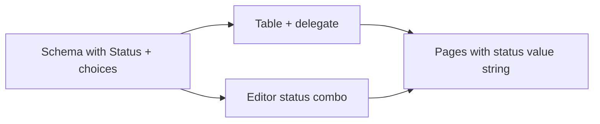

<!-- 7e4184a9-a43c-4621-b9a6-17b77982ce51 -->
# Status property feature

## Summary

- **Domain:** New `Choice` (name, category, color), `StatusProperty` type, and optional `choices` on `Property` when type is STATUS.
- **Schema:** Persist status choices in `database.json`; page value remains a single string in frontmatter.
- **DTOs only:** All cross-layer data passing uses DTOs (e.g. `ChoiceOutput` in application), never raw dictionaries.
- **Filtering:** Not implemented in this phase. The design (schema with choices, single status value per page) is left ready so that filtering by status(es) or category can be added later without breaking changes.
- **UI:** Status in add/edit property (with choices editor), status column delegate (combo + color), status editor in property panel. No filter controls in this phase.

---

## 1. Domain layer

**New: `Choice` and `StatusProperty`**

- Add `src/fern/domain/entities/properties/choice.py`: dataclass `Choice` with `name: str`, `category: str`, `color: str`. Keep it in domain (no I/O).
- Add `src/fern/domain/entities/properties/status.py`: class `StatusProperty` with `TYPE_KEY = "status"`, `default_value() -> ""`, `validate(value) -> bool` (isinstance str), `coerce(value) -> str` (same as string).

**Extend `Property` and `PropertyType`**

- In `property.py`: add optional `choices: list[Choice] | None = None` (only meaningful when `type` is STATUS).
- In `type_.py`: add `STATUS = StatusProperty` to the enum; include in `user_creatable()`.
- Export `Choice` and `StatusProperty` from `properties/__init__.py` and `entities/__init__.py`.

---

## 2. Schema persistence (interface adapters)

**`vault_database_repository.py`**

- **Serialization:** In `_property_to_dict`, when `p.type` is STATUS and `getattr(p, 'choices', None)` is set, add `"choices": [{"name": c.name, "category": c.category, "color": c.color} for c in p.choices]`. (Dicts only at the JSON file boundary; in-memory we use domain `Choice`.)
- **Deserialization:** In `_property_from_dict`, when `PropertyType.from_key(raw)` is STATUS, read `choices` from the dict (list of dicts), build `list[Choice]` (domain type), and construct `Property(..., choices=...)`. Default to `[]` if missing.

Schema format for a status property:

```json
{
  "id": "status",
  "name": "Status",
  "type": "status",
  "choices": [
    {"name": "Not Started", "category": "To Do", "color": "#94a3b8"},
    {"name": "Backdrop", "category": "To Do", "color": "#64748b"}
  ]
}
```

---

## 3. Application layer: add/update property with choices

**AddPropertyUseCase**

- Extend `Input` with optional `choices: list[Choice] | None = None` (domain type). When type is STATUS, set `Property(..., choices=choices or [])`. The controller converts `ChoiceOutput` → `Choice` before calling the use case.
- No change to repository port; `save_schema` already accepts `list[Property]`.

**UpdatePropertyUseCase**

- Extend `Input` with optional `new_choices: list[Choice] | None = None` (domain type). When updating a property, if `new_choices is not None` and type is STATUS, set `updated = Property(..., choices=new_choices)`. When type changes to/from STATUS, handle choices (e.g. clear when changing away from status, default to [] when changing to status). The controller converts `ChoiceOutput` → `Choice` before calling the use case.
- When building the updated `Property` for schema, preserve or set `choices` from `new_choices` when present.

**ApplyPropertyToPagesUseCase / AddPagePropertyUseCase**

- Already use `type.default_value()` and coerce; StatusProperty returns `""`, so no change except that new status properties will get empty string value on existing pages.

**Filtering (future)**

- Filtering by status(es) or category is out of scope for this phase. Design so it can be added later: schema already exposes choices (with category); page value is a single status name string. A future filter can be applied in the layer that builds the page list for the view.

---

## 4. Application DTOs and OpenVault output

**ChoiceOutput DTO (application layer)**

- Introduce an application-level DTO for a single choice, e.g. in `open_vault.py` or a small `application/dto.py`: `ChoiceOutput` with `name: str`, `category: str`, `color: str`. Use this type everywhere data crosses into or out of the application layer (never pass raw dicts).

**OpenVaultUseCase**

- Extend `PropertyOutput` with optional `choices: tuple[ChoiceOutput, ...] | None = None`. When building schema output, for each property with type status and `p.choices`, set `choices=tuple(ChoiceOutput(name=c.name, category=c.category, color=c.color) for c in (p.choices or []))`.
- `PagePropertyOutput` stays as-is (value only); choices come from schema.

**VaultRepository / Database**

- No change to domain `Database` or `Page`; `Property` already gets `choices` on the schema side. The vault repository implementation already returns `Database` with `properties` from schema; once those are `Property` instances with `choices`, the open-vault use case maps them to the output DTO using `ChoiceOutput`.

---

## 5. Controller and factory (DTOs only)

- **Controller:** Extend `add_property` to accept optional `choices: list[ChoiceOutput] | None = None`. Convert `ChoiceOutput` to domain `Choice` and pass `list[Choice]` to AddPropertyUseCase. Extend `update_property` to accept optional `new_choices: list[ChoiceOutput] | None = None`; convert to `list[Choice]` and pass to UpdatePropertyUseCase. No dictionaries at the controller boundary.
- **ControllerFactory:** When calling `add_property` / `update_property`, pass through the new parameters (from UI dialogs); UI passes `ChoiceOutput` instances (from schema or from the property-settings form).

---

## 6. UI: property settings (add/edit) and type option

- **PropertySettingsWidget** (`property_settings_widget.py`): Add `"Status"` to `TYPE_DISPLAY_TO_KEY` and `TYPE_OPTIONS`. When the selected type is Status, show an inline or expandable section to edit choices: list of rows (name, category, color) with add/remove. Expose `get_choices() -> list[ChoiceOutput]` and `set_choices(choices: list[ChoiceOutput])` so the dialog works with DTOs only (no dicts).
- **PropertyManager:** For add property: if type_key is `"status"`, get choices from the form via `get_choices()` (returns `list[ChoiceOutput]`), pass to controller `add_property(..., choices=...)`. For edit property: when the property is status, load current choices from the schema property into the form using `set_choices(...)` with `ChoiceOutput` instances (schema property’s choices converted to `ChoiceOutput` in the adapter or view). On save, call `update_property(..., new_choices=...)` with the form’s `ChoiceOutput` list.
- **Edit property dialog:** Must receive the current schema property (with choices) when editing; the existing `edit_property(..., prop, ...)` already has the prop. Ensure the schema passed to the view includes choices for status (as `ChoiceOutput` or domain `Choice` that the view converts to `ChoiceOutput` for the widget).

---

## 7. UI: table column and editor for status

- **PagesView:** In `_fill_table`, for columns whose type is `"status"`, use a status-aware delegate (see below). Pass the schema property (with choices as ChoiceOutput or equivalent DTO from the schema) into the delegate so it can show a combo of choice names and optionally colors. When the user picks a value, emit `property_value_changed` with the chosen status name string.
- **Delegate:** Add a combo delegate (or reuse a generic one) that, for status columns, gets choices from the schema and displays them; optionally show color (e.g. colored dot or background). Register it in the same way as `_checkbox_delegate` for boolean columns. Schema property carries choices as DTOs (e.g. ChoiceOutput), not dicts.
- **PropertyField** (`property_field.py`): Register an editor for `"status"` that creates a combo (or list) of choices. The editor needs `choices` at runtime—extend `set_property(self, label, property_type, value, **kwargs)` to accept optional `choices: list[ChoiceOutput]` (or a single type for choice DTOs) and pass it to the status editor factory. Where PropertyField is used (e.g. editor view), pass choices from the schema (as DTOs) when building the field for a status property.
- **Editor view / Page data:** When building property fields for the editor, for each property with type `"status"`, pass the schema’s choices (from the current database schema) into the status editor so the combo is populated.

---

## 8. Wire schema with choices through the stack

- **VaultView / DatabasesOverviewWindow / DatabaseWindow:** When calling `set_pages(..., schema=..., property_order=...)`, the schema objects must include `choices` for status properties (as `tuple[ChoiceOutput, ...]` or equivalent) so the table delegate can read them. The schema comes from `getattr(db, "schema", ())` which is built by OpenVaultUseCase; ensure `PropertyOutput` includes `choices` and that the view stores and passes these schema objects to the table. Design is ready for a future filter UI to consume the same schema/choices.
- **PageData / PropertyData:** If the editor or table needs to show choice metadata (e.g. color) by property_id, it can read from the schema (list of property objects with `choices`), not from PropertyData. So no change to PropertyData unless we want to duplicate choices there; prefer passing schema separately. (multi-select or tags) or select a category (single select from unique categories of that property’s choices).

---

---

## Data flow (high level)



---

## Files to add

- `src/fern/domain/entities/properties/choice.py`
- `src/fern/domain/entities/properties/status.py`
- (Optional) `src/fern/infrastructure/pyside/components/status_delegate.py` or similar if the delegate is non-trivial

## Files to modify

- `src/fern/domain/entities/properties/property.py` — add `choices`
- `src/fern/domain/entities/properties/type_.py` — add STATUS, user_creatable
- `src/fern/domain/entities/properties/__init__.py` and `entities/__init__.py` — exports
- `src/fern/interface_adapters/repositories/vault_database_repository.py` — read/write choices in schema
- `src/fern/application/use_cases/add_property.py` — Input + choices
- `src/fern/application/use_cases/update_property.py` — Input + new_choices, preserve choices when type is STATUS
- `src/fern/application/use_cases/open_vault.py` — PropertyOutput.choices
- `src/fern/infrastructure/controller.py` — add_property / update_property signatures
- `src/fern/infrastructure/factory/controller_factory.py` — pass choices/new_choices
- `src/fern/infrastructure/pyside/components/property_settings_widget.py` — Status type + choices editor
- `src/fern/infrastructure/pyside/views/property_manager.py` — get/set choices in add/edit
- `src/fern/infrastructure/pyside/views/pages_view.py` — status delegate, pass schema with choices
- `src/fern/infrastructure/pyside/components/property_field.py` — register status editor (with choices from kwargs)
- Editor view / place that builds PropertyFields — pass choices (as DTOs) for status type

---

## Testing

- **Domain:** Unit tests for Choice, StatusProperty (default_value, validate, coerce), Property with choices, PropertyType.from_key("status"), user_creatable includes STATUS.
- **Repository:** Tests that schema round-trip (read/write) for a status property with choices; legacy schema without choices still loads (choices default to []).
- **Use cases:** Add property with type status and choices; update property with new_choices; open vault returns PropertyOutput with choices (ChoiceOutput DTOs) for status.
- **Future (filtering):** When filtering is added, unit test a small helper that, given pages + schema + filter (statuses or category), returns the correct subset.

---

## Optional / later

- Color picker in the choices editor (instead of free-form hex string).
- Default color palette for new choices.
- Validation: status value on a page should be one of the property’s choice names (coerce can leave invalid values; could add validation in use case or UI).
