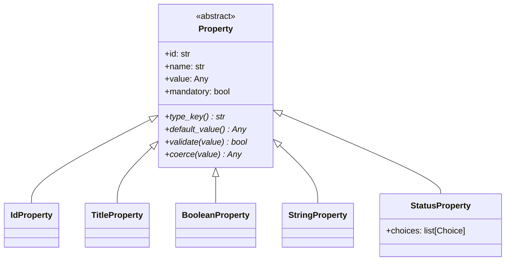

<!-- 70c97247-641d-41bf-8b7e-b0f9573b1b55 -->
---
todos:
  - id: "base-class"
    content: "Convert Property to abstract base class with abstract methods (type_key, default_value, validate, coerce) and shared fields (id, name, value, mandatory). Remove type and choices fields."
    status: pending
  - id: "concrete-types"
    content: "Make BooleanProperty, StringProperty, IdProperty, TitleProperty inherit from Property base. Move from classmethods to instance methods. Add choices field to StatusProperty."
    status: pending
  - id: "property-type-enum"
    content: "Update PropertyType enum: change from holding class references to providing factory/lookup. Keep key(), from_key(), user_creatable(). Add create() or default_value_for_key() helper."
    status: pending
  - id: "update-exports"
    content: "Update __init__.py exports in domain/entities/properties/ and domain/entities/."
    status: pending
  - id: "update-use-cases"
    content: "Update all use cases (add_property, update_property, add_page_property, apply_property_to_pages, update_page_property, open_vault) to use new API: direct construction, property.coerce(), property.type_key(), isinstance checks."
    status: pending
  - id: "update-repositories"
    content: "Update vault_database_repository and markdown_page_repository to construct concrete types and use new property API."
    status: pending
  - id: "update-infrastructure"
    content: "Update controller.py (default_value_for_type, user_creatable_type_keys) and controller_factory.py (save_page closure) for new API."
    status: pending
  - id: "verify"
    content: "Run tests and linting to verify no regressions."
    status: pending
isProject: false
---
# Unify Property Into a Single Class Hierarchy

## Current Design

- `Property` is a generic dataclass with fields: `id`, `name`, `type` (a `PropertyType` enum), `value`, `mandatory`, `choices`
- Separate type classes (`BooleanProperty`, `StringProperty`, `StatusProperty`, `IdProperty`, `TitleProperty`) are used only as strategy objects via `PropertyType` enum (e.g. `PropertyType.BOOLEAN.value` is the `BooleanProperty` class)
- `choices` lives on the generic `Property` but is only relevant for `StatusProperty`

## New Design

Each concrete type is a dataclass inheriting from an abstract `Property` base. The `PropertyType` enum stays for serialization/lookup but its members no longer hold the type class as value -- instead it provides a factory method to create instances.

## Files to Change

### 1. Domain layer -- property base and concrete types

- **`src/fern/domain/entities/properties/property.py`** -- Convert to abstract base class with abstract methods `type_key()`, `default_value()`, `validate()`, `coerce()`. Fields: `id`, `name`, `value`, `mandatory`. Remove `type` and `choices` fields.

- **`src/fern/domain/entities/properties/boolean.py`** -- Make `BooleanProperty` a dataclass inheriting `Property`. Implement `type_key() -> "boolean"`, `default_value()`, `validate()`, `coerce()`. Remove `TYPE_KEY` class var.

- **`src/fern/domain/entities/properties/string.py`** -- Same pattern as boolean, `type_key() -> "string"`.

- **`src/fern/domain/entities/properties/status.py`** -- Same pattern, plus add `choices: list[Choice]` field (defaults to `[]`). `type_key() -> "status"`.

- **`src/fern/domain/entities/properties/id_.py`** -- Same pattern, `type_key() -> "id"`, `mandatory` defaults to `True`.

- **`src/fern/domain/entities/properties/title.py`** -- Same pattern, `type_key() -> "title"`, `mandatory` defaults to `True`.

- **`src/fern/domain/entities/properties/type_.py`** -- Update `PropertyType` enum. Members no longer hold the class as value. Add a `create(id, name, **kwargs) -> Property` factory method and update `from_key()`. Keep `key()` and `user_creatable()`.

- **`src/fern/domain/entities/properties/__init__.py`** -- Update exports (keep all, `Property` is now the abstract base).

- **`src/fern/domain/entities/__init__.py`** -- Same exports, no structural change.

- **`src/fern/domain/entities/properties/choice.py`** -- No change.

### 2. Application layer -- use cases and DTOs

- **`src/fern/application/use_cases/add_property.py`** -- Replace `Property(id=..., type=..., choices=...)` construction with concrete type instantiation (e.g. `StatusProperty(id=..., choices=...)`, `BooleanProperty(id=...)`). Remove `_choices_from_dto` and `_choices_from_property_dto` helpers.

- **`src/fern/application/use_cases/update_property.py`** -- Replace `Property(...)` construction with concrete type. Update `_resolve_new_choices` to work with `StatusProperty.choices`. Update `_coerce_value` and `_updated_properties_for_page` to call `property.coerce()` instead of `property.type.value.coerce()`.

- **`src/fern/application/use_cases/add_page_property.py`** -- Replace `PropertyType.from_key(...).value.default_value()` + `Property(...)` with `PropertyType.from_key(...).create(id=..., name=...)` or direct construction.

- **`src/fern/application/use_cases/apply_property_to_pages.py`** -- Same pattern as above.

- **`src/fern/application/use_cases/update_page_property.py`** -- Replace `property.type.value.coerce(...)` with `property.coerce(...)`. Replace `Property(...)` construction with concrete type instantiation based on existing property's type.

- **`src/fern/application/dtos.py`** -- No change needed (DTOs stay the same).

### 3. Interface adapters -- repositories

- **`src/fern/interface_adapters/repositories/vault_database_repository.py`** -- Update `_property_from_dict` to instantiate concrete types (e.g. `StatusProperty(id=..., choices=...)`) instead of generic `Property`. Update `_property_to_dict` to read `property.type_key()` and check `isinstance(property, StatusProperty)` for choices. Update `ID_PROPERTY`/`TITLE_PROPERTY` constants.

- **`src/fern/interface_adapters/repositories/markdown_page_repository.py`** -- Update `_properties_from_raw` to use `PropertyType.from_key(...).create(...)` or direct construction. Update `_properties_to_raw` to use `property.type_key()`.

### 4. Infrastructure -- controller and factory

- **`src/fern/infrastructure/controller.py`** -- Update `default_value_for_type` to use the new API (e.g. `PropertyType.from_key(type_key).create(...).default_value()` or a static method on `PropertyType`).

- **`src/fern/infrastructure/factory/controller_factory.py`** -- Update `save_page` to construct concrete types instead of `Property(...)`. The `add_property` and `update_property` closures stay largely the same since they work with DTOs.

### 5. Open vault use case

- **`src/fern/application/use_cases/open_vault.py`** -- Update `_schema_property_to_output` to use `property.type_key()` instead of `property.type.key()`, and `isinstance(property, StatusProperty)` with `property.choices` instead of `getattr(property, "choices", None)`.

### 6. Domain repositories (port type hints)

- **`src/fern/domain/repositories/database_repository.py`** -- `Property` import stays (it's now the abstract base). Type hints remain `list[Property]`.

- **`src/fern/domain/repositories/page_repository.py`** -- Same, no change needed.

- **`src/fern/domain/entities/database.py`** -- Same, `properties: list[Property]` still works via polymorphism.
