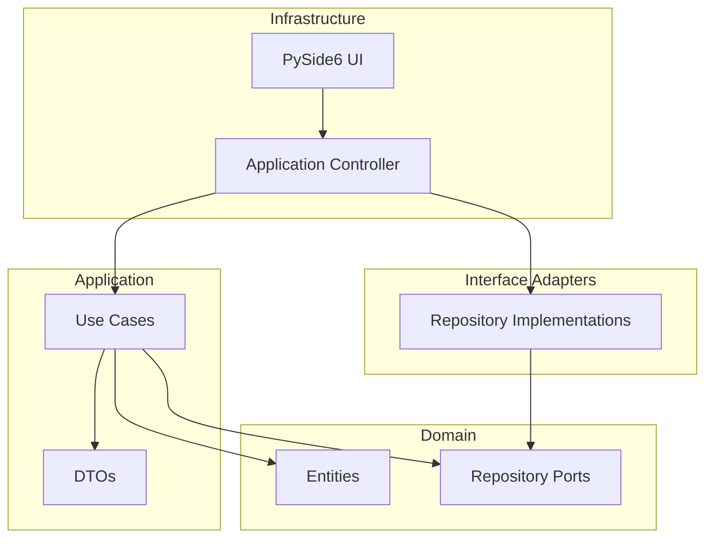

# Clean Architecture

Dependencies point **inward only**. Inner layers never import from outer layers.

## Layer Rules

### Domain (`fern.domain`)

- **Entities**: `Page`, `Database`, `Vault`, `Property`, `PropertyType`, `Choice`
- **Repository ports**: abstract base classes defining persistence interfaces
- **No framework imports.** No I/O. Pure Python.

### Application (`fern.application`)

- **Use cases**: single-purpose classes with an `execute()` method
- **DTOs**: frozen dataclasses for input/output — no domain entities leak out
- **Errors**: typed exception classes with descriptive messages
- Depends on domain only. Never imports from interface_adapters or infrastructure.

### Interface Adapters (`fern.interface_adapters`)

- Implements repository ports: filesystem vault, markdown page repository, etc.
- Translates between domain entities and concrete I/O (files, frontmatter, JSON)

### Infrastructure (`fern.infrastructure`)

- **Controller**: `AppController` — thin façade calling use cases. Re-exports application errors and output types so the UI never imports from `fern.application` or `fern.domain`.
- **Application Controller**: Binds the dependencies to the use cases depending on the current platform, used through a factory.
- **PySide6 UI**: views, components, styles, icons, actions. Depends **only** on `AppController`.

## Where to Put New Code

| You want to... | Put it in... |
|----------------|-------------|
| Add a new entity or value object | `domain/entities/` |
| Add a new repository interface | `domain/repositories/` |
| Add a new use case | `application/use_cases/` |
| Add new input/output DTOs | `application/dtos.py` |
| Add a new filesystem adapter | `interface_adapters/repositories/` |
| Add a new UI view | `infrastructure/pyside/views/` |
| Add a new reusable widget | `infrastructure/pyside/components/` |
