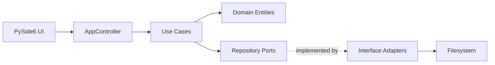

# Architecture Overview

## Project Structure

```
src/fern/
├── domain/              # Entities and repository ports
├── application/         # Use cases and DTOs
│   ├── dtos.py
│   ├── errors/
│   └── use_cases/
├── interface_adapters/  # Repository implementations
│   └── repositories/
└── infrastructure/      # Framework-specific code
    ├── controller.py    # AppController — thin façade over use cases
    ├── factory/         # Wiring: builds repos, use cases, controller
    └── pyside/          # PySide6 UI (see PySide docs)
```

## Data Flow



1. The **UI** calls `AppController` methods. It **never** imports from `fern.application` or `fern.domain` directly.
2. `AppController` delegates to **use cases** in `application/` and re-exports output types and errors for the UI.
3. Use cases operate on **domain entities** and call **repository ports** (abstract interfaces).
4. **Interface adapters** implement those ports against the filesystem.
5. The **factory** wires everything together at startup.

## Entry Point

`fern.__main__:main` → creates a `QApplication`, builds the controller via the factory, loads the global stylesheet, and shows `MainWindow`.
