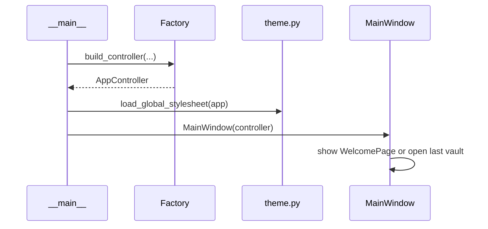

# PySide6 UI Overview

The PySide6 UI lives at `src/fern/infrastructure/pyside/`. It is the outermost layer — it depends **only** on `AppController` (from `fern.infrastructure.controller`), never on `fern.application` or `fern.domain` directly.

## Directory Layout

```
pyside/
├── __init__.py          # Re-exports MainWindow and view classes
├── actions.py           # Action registry: menu bar, context menus, options menus
├── theme.py             # Loads and applies QSS stylesheets
├── utils.py             # Shared helpers: icon loading, reveal-in-explorer, etc.
├── recent_vaults.py     # Persists recent vault paths to ~/.fern/
│
├── views/               # Screen-level views (see Views docs)
│   ├── base.py          # FernView base class with toolbar
│   ├── main_window.py   # Top-level QMainWindow
│   ├── welcome_page.py  # Welcome screen
│   ├── vault_view.py    # File-tree sidebar + content stack
│   ├── database_view.py # Database list (cards)
│   ├── pages_view.py    # Pages table
│   ├── editor_view.py   # Page editor
│   ├── database_window.py           # Standalone database window
│   ├── databases_overview_window.py # All-databases window
│   ├── database_view_coordinator.py # Shared CRUD logic
│   ├── database_page_manager.py     # Page operations manager
│   ├── property_manager.py          # Property CRUD manager
│   ├── root_page_manager.py         # Root .md file manager
│   ├── page_data.py                 # PageData/PropertyData dataclasses
│   └── vault_tree_model.py          # File-tree model
│
├── components/          # Reusable widgets (see Components docs)
│   ├── dialogs/         # Confirmation, error, property edit dialogs
│   ├── properties/      # Property field, card, cards container, settings
│   ├── table/           # Table view, model, cell delegates
│   ├── card.py          # Generic clickable card
│   ├── command_palette.py # Cmd+P command palette
│   ├── markdown_highlighter.py
│   └── toast.py         # Toast notifications
│
├── styles/              # QSS stylesheets
│   ├── base.qss
│   ├── welcome.qss
│   ├── card.qss
│   ├── table.qss
│   ├── vault.qss
│   └── editor.qss
│
└── icons/               # SVG assets
```

## Startup Flow



## Dependency Rule

The PySide layer **never** imports from `fern.application` or `fern.domain`. All interaction goes through `AppController`:

- **Types**: output DTOs like `VaultOutput` and `ChoiceOutput` are re-exported from `fern.infrastructure.controller`
- **Errors**: application errors (`VaultNotFoundError`, `PropertyNotFoundError`, etc.) are re-exported from `fern.infrastructure.controller`
- **Helpers**: `default_value_for_type(type_key)` and `user_creatable_type_keys()` are provided by the controller module

```python
# Correct: import from controller
from fern.infrastructure.controller import AppController, VaultOutput, VaultNotFoundError

# Wrong: never do this in PySide
from fern.application.use_cases.open_vault import OpenVaultUseCase  # ✗
from fern.domain.entities import PropertyType                        # ✗
from fern.application.errors import VaultNotFoundError               # ✗
```
