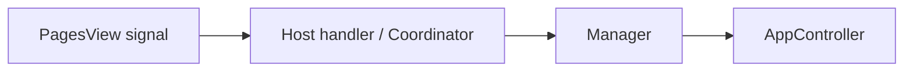

# Recurring Patterns

## Coordinator Pattern

When multiple host views need the same business logic (page CRUD, property CRUD, refresh), extract a **coordinator** — a plain class that takes the relevant widgets and managers as constructor dependencies and exposes handler methods.

```python
class DatabaseViewCoordinator:
    def __init__(self, *, database_page_manager, property_manager,
                 pages_view, editor_view, stack, host): ...

    def wire_signals(self): ...
    def on_page_activated(self, page): ...
    def on_editor_save(self): ...
    def refresh(self): ...
```

The host view creates the coordinator, calls `wire_signals()`, and only overrides methods where it has special behavior.

## Manager Pattern

Non-widget service objects that wrap `AppController` calls and own dialog/error handling:

```python
class PropertyManager:
    def __init__(self, controller, vault_path): ...
    def add_property(self, database_name, parent) -> bool: ...
    def edit_property(self, database_name, prop, parent) -> bool: ...
```

**Convention**: managers return `bool` (success/fail) or data/`None`. They call `show_error()` internally when operations fail, so the caller only needs to check the return value.

## Options Menu Builder

Use `build_options_menu()` to eliminate repetitive menu-construction loops:

```python
from fern.infrastructure.pyside.actions import PAGES_VIEW_ACTIONS, build_options_menu

def _on_options_clicked(self):
    callbacks = {
        "new_page": self.new_page_requested.emit,
        "add_property": self.add_property_requested.emit,
    }
    menu = build_options_menu(self, PAGES_VIEW_ACTIONS, callbacks)
    menu.exec(btn.mapToGlobal(btn.rect().bottomLeft()))
```

Use `skip_ids` to conditionally hide items:

```python
skip = {"add_property"} if not self._in_database else None
menu = build_options_menu(self, EDITOR_VIEW_ACTIONS, callbacks, skip_ids=skip)
```

## Signal Wiring

Views communicate via Qt signals. The pattern is:

1. **View defines signals** (e.g. `page_activated = Signal(object)`)
2. **Host connects signals** to handler methods (or coordinator methods)
3. **Handler calls manager** or coordinator, which calls `AppController`



## Toast Notifications

Use `show_toast(parent, message)` for non-intrusive feedback:

```python
from fern.infrastructure.pyside.components import show_toast
show_toast(self, "Saved")
```

## Error Display

Use `show_error(parent, message, title=...)` for error dialogs:

```python
from fern.infrastructure.pyside.components import show_error
show_error(self, "Something went wrong.", title="Operation failed")
```

## Error Handling

Application errors are re-exported from the controller module:

```python
from fern.infrastructure.controller import (
    PropertyNotFoundError,
    VaultNotFoundError,
)

try:
    self._controller.open_vault(path)
except VaultNotFoundError as error:
    show_error(self, error.message)
```

Never import errors from `fern.application.errors` directly in PySide code.
