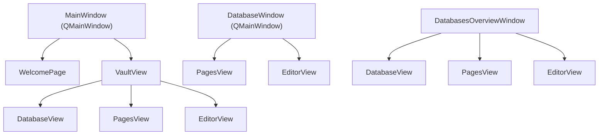

# Views

Views are screen-level widgets in `pyside/views/`. Each view is a `QWidget` (or `QMainWindow`) responsible for a single screen.

## View Hierarchy



## FernView Base Class

All content views (`PagesView`, `EditorView`, `DatabaseView`) extend `FernView`, which provides:

- A **toolbar** with a back button and an options button
- A **content area** (`content_layout()`) for subclass content
- A `currentView` property for QSS scoping
- Signals: `back_requested`, `options_clicked`

## DatabaseViewCoordinator

The **coordinator pattern** eliminates ~500 lines of duplicated CRUD logic. Three host views need the same page/property operations:

| Host | Context |
|------|---------|
| `VaultView` | Vault sidebar + content stack |
| `DatabaseWindow` | Standalone single-database window |
| `DatabasesOverviewWindow` | All-databases overview window |

The coordinator encapsulates:

- **Signal wiring** — connects `PagesView` and `EditorView` signals to handlers
- **Page CRUD** — activate, save, delete, create
- **Property CRUD** — add, edit, remove, save column order
- **Refresh** — reload vault and update the pages table

### Usage

```python
self._coordinator = DatabaseViewCoordinator(
    database_page_manager=database_page_manager,
    property_manager=property_manager,
    pages_view=self._pages_view,
    editor_view=self._editor_view,
    stack=self._stack,
    host=self,
)
self._coordinator.wire_signals()
```

### VaultView Override Pattern

`VaultView` handles both **root pages** (standalone `.md` files) and **database pages**. It connects some signals to its own override methods that branch on `self._current_root_page`:

- If editing a root page → handle locally (root page manager)
- If editing a database page → delegate to `self._coordinator`

## Manager Classes

Non-widget service objects that encapsulate controller calls:

| Manager | Responsibility |
|---------|---------------|
| `DatabasePageManager` | Page CRUD within a database. Stateful: tracks current database, schema, property order. |
| `PropertyManager` | Schema property CRUD: add/edit/remove/reorder. Stateless. |
| `RootPageManager` | Root `.md` file operations: load/save/create/delete with frontmatter. |
